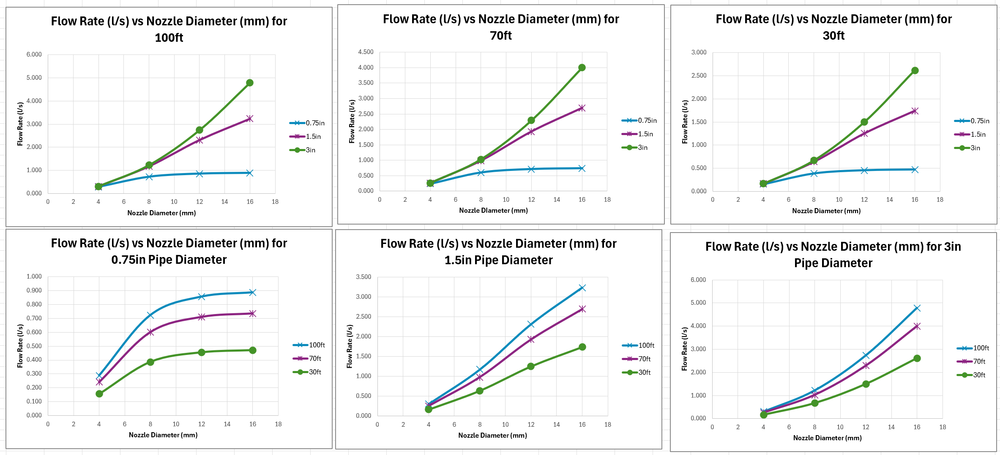

# Miyu Nakamori
### Mechanical Engineering Student | Seattle Pacific University
Expected Graduation: June 2026

---

## About Me
I am a Mechanical Engineering student with a passion for robotics, renewable energy systems, and inclusive design. My goal is to develop technologies that protect people and enhance quality of life. I have hands-on experience in CAD modeling (SolidWorks), control algorithms, and research simulations.

---

## Experience

### Engineering Intern | Seattle City Light
*Engineering & Technology Operations Division*
* **Role & Responsibilities:**
    * Developed Excel calculation models to validate cost estimate analysis for distribution infrastructure.
    * Structured and optimized engineering specification libraries on SharePoint to streamline design workflows.
    * Assisted the division by digitizing legacy technical resources for improved accessibility.
* **Outcomes:**
    * Prioritized daily tasks between modernization projects and mandatory training sessions.
    * Completed technical certifications (Electrical Hazard Recognition, CPR, AED, and First Aid).
    * Conducted validation testing of new tools against legacy standards to ensure grid reliability.

[Electrical Hazzard Recognition Training]
(Electrical Hazzard Recognition Training.png)
---

## Projects

### Autonomous Mobile Solar Generator (Senior Capstone)
*Team Lead*
* **Objective:** Designing a mechatronic system that autonomously analyzes weather data to optimize solar power generation efficiency.
* **Role:** Leading the mechanical design and sensor integration for the weather analysis unit.
* **Status:** Currently conducting CAD modeling and sensor selection.

### Field Work on Blakely Island: Fluid Dynamics Analysis
*Appropriate and Sustainable Engineering (ASE) Studies*
* **Overview:** Collaborated with a team of 15 students to apply fluid dynamics principles to a real-world scenario using a small Pelton turbine.
* **Analysis:** Determined theoretical flow rates versus nozzle diameters and head heights through rigorous testing with four different nozzle sizes.
* **Outcome:** Evaluated design choices of the island's existing hydroplant (installed in the 1970s) and proposed modern design improvements.

*Working in a team, we determined the theoretical flow rates vs. nozzle diameters and head heights.

### Leveraging AWES to Build Reliable Microgrids (Research)
*Published in 2025 IEEE PES/IAS PowerAfrica | Co-Author*
* **Overview:** Investigated the integration of Airborne Wind Energy Systems (AWES) for remote microgrids in Nome, Alaska.
* **Result:** Simulations demonstrated that a 48MW AWES configuration could meet 100% of annual demand, significantly outperforming traditional Solar PV options for that region.

### NASA Space Apps Challenge: Exoplanet Simulation
*1st Place Winner (Seattle Region)*
* **Overview:** Formulated a scientifically grounded exoplanet environment. Calculated gravitational parameters to simulate the growth patterns of native fungal life forms under specific planetary conditions.
* **Role:** Team Lead & Physics Modeling.

### Robotic Arm Control Implementation
* **Description:** Programmed control algorithms (forward/inverse kinematics) for a 6-DOF robotic arm to perform precise pick-and-place tasks.
* **Skills:** Robotics Control, Algorithm Design.

### Gearbox & Prosthetic Hand Design
* **Myoelectric Prosthesis:** Designed a prosthetic hand with a custom 4-bar linkage structure for each finger using SolidWorks to detect muscle contractions.
* **Gearbox:** Modeled a multi-stage gearbox performing stress analysis and material selection to meet specific torque and speed requirements.

---

## Contact
* **Email:** [Your Email Address]
* **LinkedIn:** [Your LinkedIn Profile URL]
